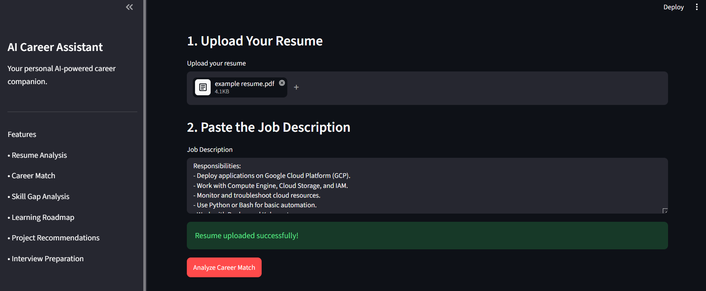
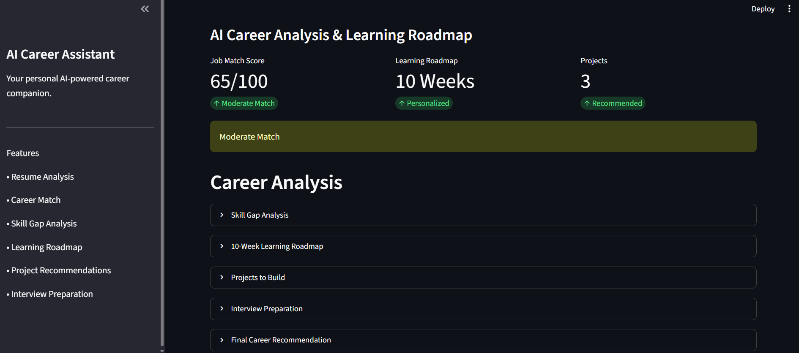
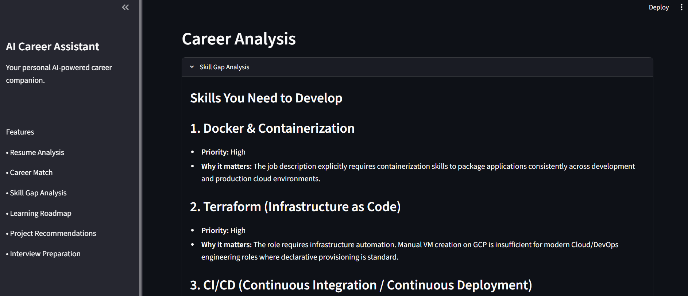
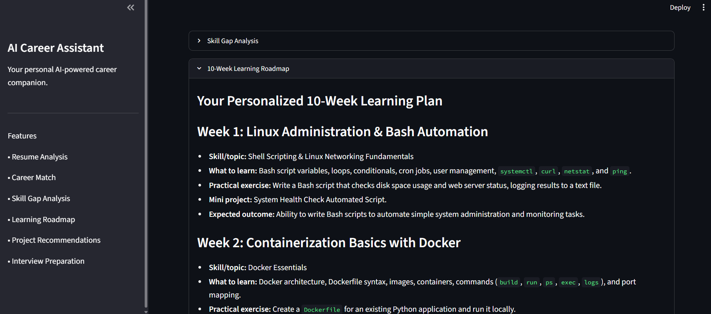
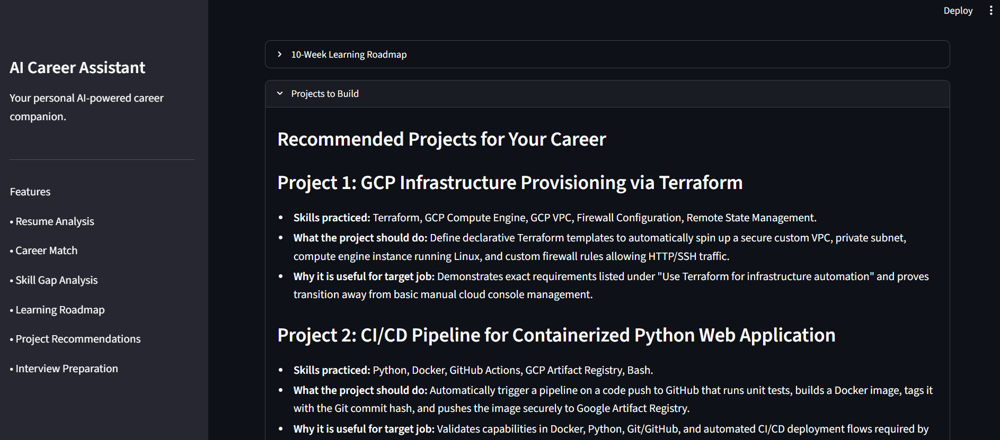
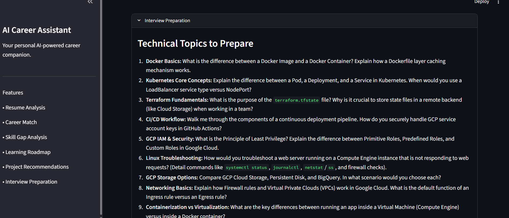
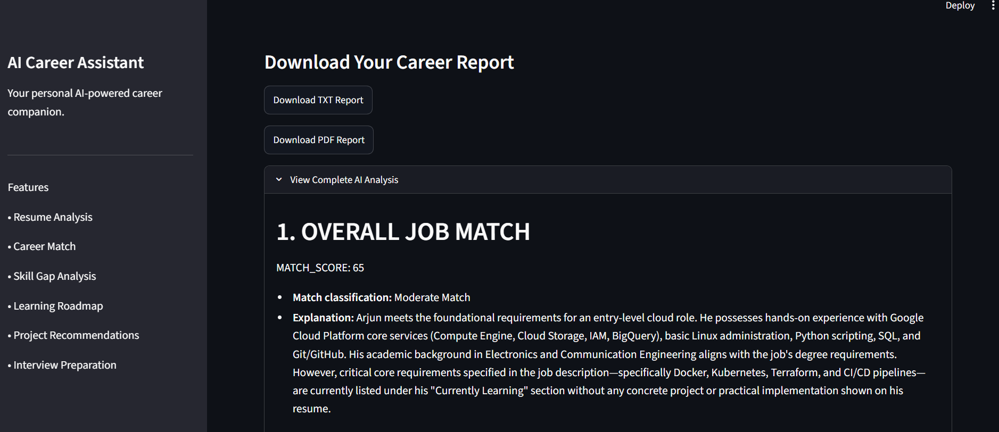

# AI Career Assistant

## Project Overview

AI Career Assistant is an AI-powered career analysis application that helps job seekers understand how well their resume matches a target job role.
The application analyzes the candidate's resume against a job description, identifies relevant strengths and skill gaps, and generates a personalized learning roadmap to help the candidate prepare for the role.
It also recommends practical projects, provides interview preparation topics, and generates downloadable career analysis reports in TXT and PDF formats.

## Features

- Resume PDF upload and text extraction
- AI-powered career match analysis
- Job match score out of 100
- Current strengths identification
- Skill gap analysis with priorities
- Personalized 10-week learning roadmap
- Practical project recommendations
- Technical interview preparation
- Final career recommendation
- Downloadable TXT career report
- Downloadable PDF career report
- User-friendly Streamlit dashboard

## How It Works

1. Upload your resume in PDF format.
2. Paste the target job description.
3. Click **Analyze Career Match**.
4. The application extracts the resume content.
5. Gemini analyzes the resume against the job description.
6. The application displays the career analysis and learning roadmap.
7. Download the generated career report as TXT or PDF.

## Tech Stack

- **Python** — Core programming language
- **Streamlit** — Web application and user interface
- **Google Gemini API** — AI-powered resume and career analysis
- **Google GenAI SDK** — Integration with Gemini models
- **PyPDF2** — Resume PDF text extraction
- **ReportLab** — PDF career report generation
- **python-dotenv** — Environment variable management
- **Git & GitHub** — Version control and project hosting

## Project Structure

```text
ai-career-assistant/
│
├── app.py
├── requirements.txt
├── .gitignore
│
└── utils/
    └── pdf_reader.py
```

## Installation

### 1. Clone the repository

```bash
git clone https://github.com/snehareddyr-2003/ai-career-assistant.git
cd ai-career-assistant
```

### 2. Create a virtual environment

```bash
python -m venv venv
```

### 3. Activate the virtual environment

Windows:

```bash
venv\Scripts\activate
```

### 4. Install dependencies

```bash
pip install -r requirements.txt
```

### 5. Configure the Gemini API key

Create a `.env` file in the project root:

```text
GEMINI_API_KEY=your_api_key_here
```

Do not upload the `.env` file or expose your API key publicly.

### 6. Run the application

```bash
streamlit run app.py
```

The application will open in your browser.

## Screenshots

### 1. Dashboard

Main interface for uploading a resume and entering the target job description.



### 2. Career Analysis

Displays the AI-generated job match score and overall career analysis.



### 3. Skill Gap Analysis

Identifies missing skills and prioritizes them based on the target role.



### 4. Learning Roadmap

Provides a personalized learning roadmap based on the identified skill gaps.



### 5. Projects Recommendation

Suggests practical projects to help the candidate improve the skills required for the target role.



### 6. Interview Preparation

Provides personalized interview topics based on the target role and identified skill gaps.



### 7. Career Report

Allows the user to download the complete AI-generated career analysis as a PDF report.



## Future Improvements

- Deploy the application to Google Cloud
- Add user authentication
- Add career history and progress tracking
- Integrate job search and job recommendations
- Support multiple resume formats
- Add interactive learning progress tracking
- Improve resume recommendations and keyword optimization
